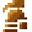
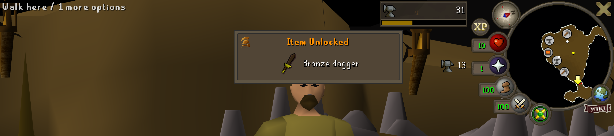
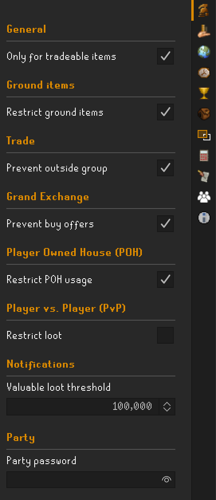

#  Bronzeman Unleashed

  
*Your adventure, your rules — the next generation of Bronzeman.*

Welcome to **Bronzeman Unleashed**, the next generation of Bronzeman gameplay for both **solo adventurers** and **group
players** alike.  
Built with passion for the game, this plugin hopes to bring Bronzeman mode to more players and to have it redefine how
you can experience Gielinor.

---

## What Is Bronzeman mode?

Bronzeman mode is like playing Ironman mode — without having to deal with the chores of playing an Ironman.

It gives you more freedom in doing content you like doing, but retains the rewarding grind of an Ironman to unlock
certain items before you can use them.
Unlike a normal account, you cannot trade items you haven't unlocked yet, but once you do you can trade them freely.

Bronzeman mode is also great if you enjoy doing PvP, as you can configure the game rules to allow PvP loot to count as
unlocks.

So no more herbs runs to farm for supplies to go do bossing, or any other adventures that await you!

---

## 🔧 Play Bronzeman Your Way — Custom Game Rules

*Full control over your playstyle — configure your own game rules and restrictions.*

I built Bronzeman Unleashed to adapt to your journey, not the other way around.

You can define your own adventure by choosing what rules and restrictions you want to apply.

<table>
<tr>
<td>

### Item Unlocks

- **Tradeable-only mode:** Choose to track only tradeable items to reduce clutter and streamline your progression.

### Ground Items

- **Restrict pickups:** Configure whether you can only pick up items that belong to you or those that belong to your
  group members.

### Trading

- **Prevent trading outside group:** Restrict trading to your Bronzeman group only.

### Grand Exchange

- **Prevent buy offers:** Block buy offers for items not yet unlocked.

### Player Owned House (POH)

- **Restrict POH access:** Prevent entry to any POH that doesn't belong to you or your group members.

### Player vs. Player (PvP)

- **Restrict loot:** Restrict loot from PvP kills and loot keys.

### Notifications and Integration

- **Valuable drop notification:** Automatically share rare drops with your group when they exceed a set GP value.
- **Party plugin support:** Set a party password and join automatically on login.

#### And more to come in the future!

</td>
<td>

</td>
</tr>
</table>
---

## Sync your data online and get started in under five minutes

  
*Simple setup, automatic syncing — ready to play in under five minutes.*

Your data syncs online after a minimal setup.
You’ll be ready to play in under five minutes.

As of right now I decided to only support Firebase. Firebase will be free to use using their free tier.
No credit card required, just a Google account.

The plugin itself will guide you through the setup process, but you can view
the [firebase setup guide](https://github.com/elertan/bronzeman-unleashed/blob/main/firebase-guide.md) for more
details.

The plugin has been developed with the intention of supporting other
backends in the future. Feel free to create an issue with other suggestions!

---

## Unlocked Items Panel

  
*Browse, search, and filter every unlocked item with full group visibility.*

See your progress come to life.
The **Bronzeman Panel** showcases every unlocked item with:

- Search, sorting, and filtering tools.
- Detailed metadata: who unlocked it, when, and from which NPC drop (if applicable).

---

## And when you earn a new unlock, it feels special

  
*A satisfying unlock animation that celebrates your achievements.*

When you earn a new unlock, it *feels* special.  
Enjoy:

- A beautifully animated overlay celebrating your or your group member's achievement.
- A detailed chatbox message.
- Group notifications for shared triumphs.

  
*Chatbox messages record every unlock with NPC and item details.*

Every discovery is an event worth remembering.

---

## Why create Bronzeman Unleashed, instead of contributing to existing plugins?

I am aware there are multiple plugins that offer similar functionality, yet none of them were exactly what I was
looking for.
It also seemded like most projects were not actively maintained anymore, as I've tried to contribute to at least one of
them.

I wanted to create something that was **customizable** and **easy to use**. Without running into any of the issues
that come with existing plugins.
I put a lot of effort into making sure that things look good and feel natural, so it feels like it belongs in the game.

Therefore, I have taken inspiration from other plugins but decided to build my own from scratch.

---

## Take part in the journey

I hope you enjoy playing Bronzeman Unleashed.

Your feedback would be a massive help in improving the plugin. If you have any suggestions, please feel free to
[create an issue](https://github.com/elertan/bronzeman-unleashed/issues/new).

**Bronzeman Unleashed is currently in BETA.**  
Report bugs or share feedback through our [GitHub issues](https://github.com/elertan/bronzeman-unleashed/issues).